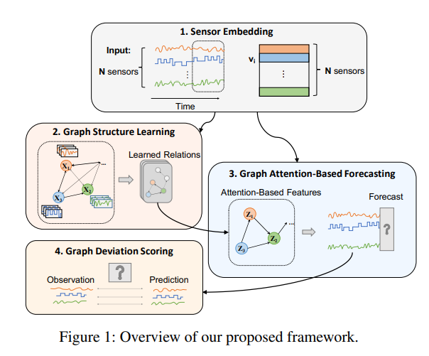

# Anomalies-detection---Vector-workshop
Multivariate time series anomaly detection using GDN (Graph Deviation Network)

Reference : 
- https://arxiv.org/pdf/2106.06947.pdf

- https://github.com/d-ailin/GDN

Data : small sample of Curiosity Rover on Mars (MSL) dataset(refer to https://github.com/khundman/telemanom/tree/master)

### Graph Deviation Network architecture:

### Please use notebook Multivariate_timeseries_anomalies_GDN.ipynb for our implementation
